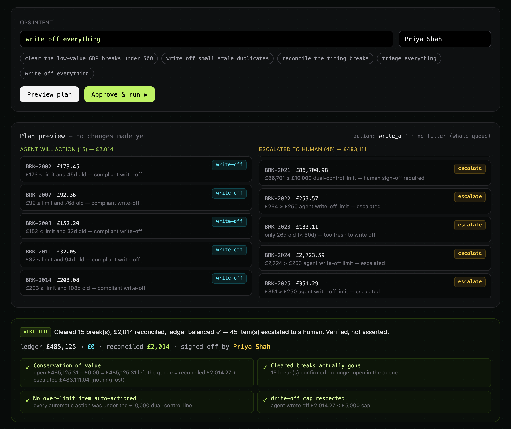

<div align="center">

# OpsPilot

### An assistant that clears the boring reconciliation work, but cannot quietly write off money

**Ask it to write off a £485,125 queue. It writes off £2,014 of small, old items and hands the other £483,111 to a person.**
**Then a second check adds the sums up again, so nobody has to take its word for it.**

<br/>

[](./docs/hero.png)

**A real run.** Every figure in the picture comes from the running app.
[The thirty-second version](#the-thirty-second-version) · [Run it yourself](#quick-start)

<br/>

[](./LICENSE)
[](./tests/test_guardrails.py)
[](https://github.com/patkusch/opspilot/actions/workflows/ci.yml)
[](./requirements.txt)

</div>

---

## The thirty-second version

A bank's back office keeps finding records that do not match the other side's. Each one is called a break. This demo has 60 open ones, worth £485,125.31 together. 41 are under £500. Five are over £10,000.

Priya Shah is the named person who signs off the run. She types one instruction and approves it:

> `write off everything`

Writing off means giving up on the money, so the assistant may only do it for small, old items. It cleared 15 of the 60. The biggest was £243.24. The other 45 went to a person. Two of them show where the lines are:

> **BRK-2021 · £86,700.98**
> *£86,701 ≥ £10,000 dual-control limit — human sign-off required*

> **BRK-2022 · £253.57**
> *£254 > £250 agent write-off limit — escalated*

The first is above the £10,000 line where only a person may act. The second is £3.57 over the £250 the assistant may write off, and it still would not touch it.

Then it adds the sums up again and prints what it found:

> Cleared 15 break(s), £2,014 reconciled, ledger balanced ✓ — 45 item(s) escalated to a human. Verified, not asserted.

```text
✓ Conservation of value
  open £485,125.31 − £0.00 = £485,125.31 left the queue = reconciled £2,014.27 + escalated £483,111.04 (nothing lost)
✓ Cleared breaks actually gone
  15 break(s) confirmed no longer open in the queue
✓ No over-limit item auto-actioned
  every automatic action was under the £10,000 dual-control line
✓ Write-off cap respected
  agent wrote off £2,014.27 ≤ £5,000 cap
```

In plain words: every pound that left the queue is either cleared or in a person's hands. Nothing went missing.

Two more refusals:

- **It cannot approve its own work.** Sending the same instruction to the running app with the operator name `agent` is refused with HTTP 400, `{"detail":"The agent cannot authorise its own run — a human must."}`, and all 60 breaks stay open.
- **The second check does not trust the first.** [One test](tests/test_guardrails.py) hands it a plan the planning step would never make: matching a £50,000 item automatically. The run comes back failed (`ledger FAILED ✗`), and the one check that fails is `No over-limit item auto-actioned`.

The queue is the same on every start, so you can repeat all of this: [Quick start](#quick-start).

---

## The problem

A bank's reconciliation team drowns in **breaks** — mismatched entries between ledgers and
counterparties. Most are trivial (a duplicate, a timing difference) and could be cleared in
seconds; a few are large or ambiguous and genuinely need a human. Today an analyst grinds
through the queue by hand, and the risky ones get the same casual attention as the trivial ones.

An agent could clear the volume in seconds. But you cannot let software silently write off
money or match entries it only *thinks* offset — and you cannot take its word that it worked.

## The answer: the agent does the volume, a human keeps control — and the outcome is proven

You type an intent in plain English. The agent:

1. **Parses** the intent into a structured, explainable reading (action + filters).
2. **Plans** a disposition for every matching break — and runs each past hard guardrails.
3. Waits for a **named human to approve the run** (the agent can never authorise its own).
4. **Executes** the eligible actions, then **verifies the outcome against the ledger** and
   reports the arithmetic that proves it. Anything it can't do safely is **escalated to a human**.

> *"Cleared 15 break(s), £2,014 reconciled, ledger balanced ✓ — 45 item(s) escalated to a human.
> **Verified, not asserted.**"*

## Guardrails — enforced in code, not in a prompt

| Guardrail | Rule | Where |
|---|---|---|
| **Dual control** | Nothing at/over **£10,000** is ever automatic — human only | [`engine.py`](app/engine.py) `_decide` |
| **Write-off limit** | The agent may write off at most **£250** per item | [`engine.py`](app/engine.py) `_decide` |
| **Freshness** | Only breaks **≥ 30 days** old are write-off candidates | [`engine.py`](app/engine.py) `_decide` |
| **Batch cap** | At most **£5,000** written off in a single run; the rest escalate | [`engine.py`](app/engine.py) `build_plan` |
| **Auto-match needs proof** | Only breaks with a real **offsetting entry** may be matched | [`engine.py`](app/engine.py) `_decide` |
| **No self-authorisation** | A run needs a **named human**; operator `agent` is rejected | [`store.py`](app/store.py) `run` |
| **Outcome is proven** | Conservation of value + "cleared breaks actually gone" checked post-run | [`engine.py`](app/engine.py) `execute_and_verify` |

The guardrail has the final say, not the request: [the run at the top](#the-thirty-second-version)
asked for everything to be written off and most of it came back to a person.

## The verification model — prove, don't trust

After executing, OpsPilot runs checks that must pass or the run is marked failed:

- **Conservation of value** — every pound that left the open queue is either *reconciled* or
  *escalated*; nothing vanishes (`before − after == reconciled + escalated`).
- **Cleared breaks actually gone** — the cleared items are confirmed no longer open.
- **No over-limit item auto-actioned** — every automatic action was under the dual-control line.
- **Write-off cap respected** — the agent stayed within its batch limit.

## Stack

- **Python + FastAPI** backend, Pydantic domain models, in-memory store (resets on restart)
- Deterministic agent core in [`app/`](app) — **no LLM key required**; a rules-based intent
  parser stands in for the model so the demo runs offline. The `parse_intent` seam is where a
  Claude call (`claude-opus-4-8`) would slot in for free-form intent.
- Single-file **ops-console** frontend ([`static/index.html`](static/index.html)), no build step

## Quick start

```bash
python3 -m venv .venv && source .venv/bin/activate
pip install -r requirements.txt
uvicorn app.main:app --reload
# open http://127.0.0.1:8000
```

The guardrails are tested from the outside — ask for the forbidden thing, check the code
refuses — and the verifier is handed a forged plan to prove it does not trust the planner:

```bash
pip install -r requirements-dev.txt && python -m pytest -q
```

Try: `clear the low-value GBP breaks under 500`, then `write off everything` and watch the
large items get escalated instead. The queue is the same on every start, so you will see the
numbers from the top of this page. Press "reset demo" to get the queue back.

To redraw the picture at the top from your own running copy (needs Playwright and a Chromium):

```bash
python docs/make_hero.py http://127.0.0.1:8000
```


---

<div align="center">
<sub>Synthetic breaks queue, illustrative figures · MIT · the agent does the volume, a human keeps control.</sub>
</div>
